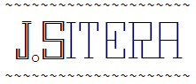

{}

1973, Pilsen

<a href="/">Family</a>,
<a href="#td-block-1">photography</a>,
<a href="https://www.sports-tracker.com/view_profile/ji%C5%99%C3%ADsitera">walking</a>,
<a href="https://500px.com/photo/1106113516/the-wonderful-light-and-the-endless-energy-of-the-sea.-by-jiri-sitera">sunshine</a>,
<a href="https://www.youtube.com/channel/UCrxtCpCMUKJkKgousCRyl6Q">water</a>

<a href="https://fav.zcu.cz">FAV ZCU</a>,
TCP/IP,
<a href="https://metacentrum.cz">HTC/HPC</a>,
distributed systems,
<a href="https://iotlab.zcu.cz">IoT</a>,
Linux, cybersecurity,
<a href="https://europen.cz">EurOpen.CZ</a>,

 

{}
{}
Moje fotografie
{.h2}
{}

{}
{}

{}
{}

{}

Moje fotografie najdete na výše odkázaných sociálních sítích. Speciální roli zde má galerie videí slow motion water kde je voda zachycena v pohybu a zpravidla v dynamickém prostředí fontány, vodopádu či vodního zařízení. Fotografie popisující konkrétní zajímavé místo umisťuji často do *[Google map](https://www.google.com/maps/contrib/113020041194461814335/photos)*. Starší fotografie jsou ve webové galerii *[Jiří Sitera photo gallery](http://home.zcu.cz/~sitera/gallery/)*.
{}

 

{}
Sociální sítě
{.h2}
{}
  {}
  
  
  {}
  {}
  
  
  {}
  {}
  
  
  {}
  {}
  
  
  {}
{}
- Západočeská univerzita v Plzni [uživatelský profil](https://home.zcu.cz/~sitera/)
- [Veřejný SSH klíč](/jiri/data/id_jiri.sitera.pub)
{}
